<h1 align="center">
  <br>
  💸 Expense Tracker
  <br>
</h1>

<h4 align="center">A clean, modern, Firebase-powered personal finance and expense tracking app built with Flutter.</h4>

<p align="center">
  
  
  
  
  
</p>

---

## 📸 App Screenshots

### 🌓 Main Screens (Dark Mode & Light Mode)

<table>
  <tr>
    <th align="center">Screen</th>
    <th align="center">Dark Theme 🌙</th>
    <th align="center">Light Theme ☀️</th>
  </tr>
  <tr>
    <td align="center"><strong>Home Dashboard</strong><br><em>Spending overview, recent transactions, period filters</em></td>
    <td>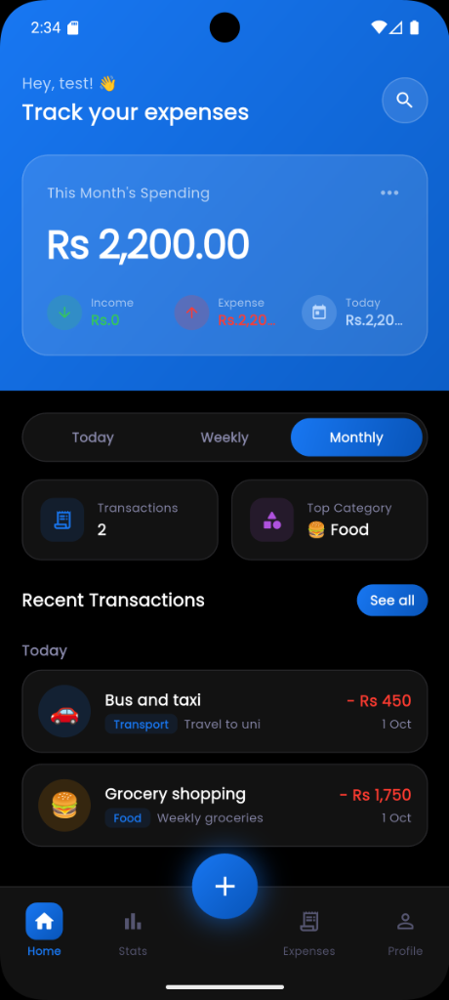</td>
    <td>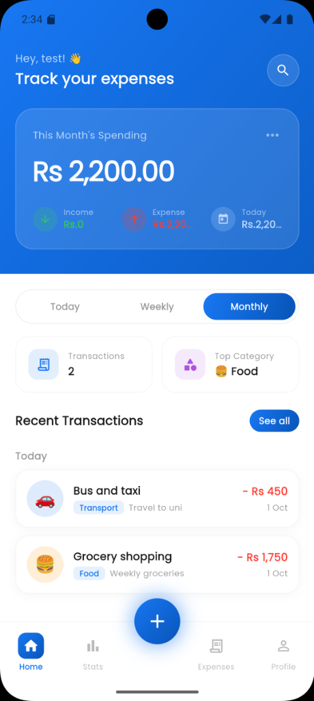</td>
  </tr>
  <tr>
    <td align="center"><strong>Statistics (Monthly)</strong><br><em>Category donut chart breakdown & percentages</em></td>
    <td>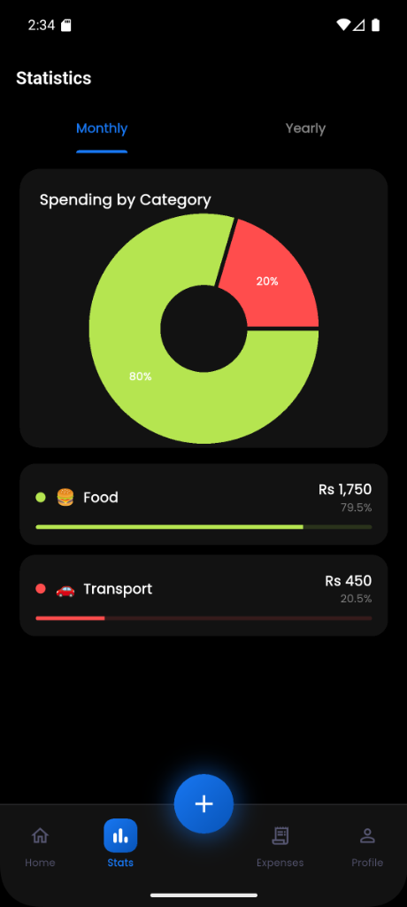</td>
    <td>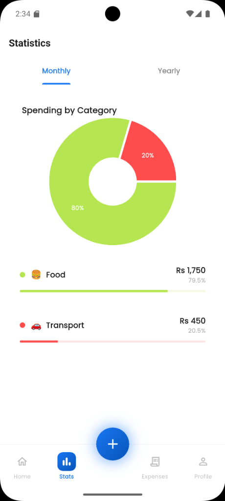</td>
  </tr>
  <tr>
    <td align="center"><strong>Add / Edit Expense</strong><br><em>Interactive category selector, amount, date & note</em></td>
    <td>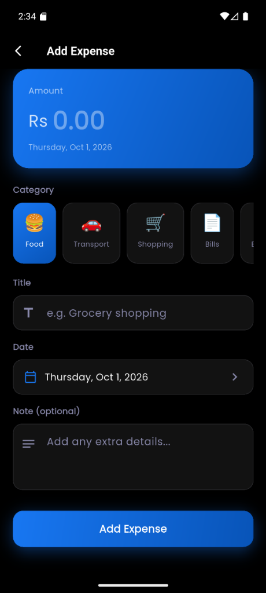</td>
    <td>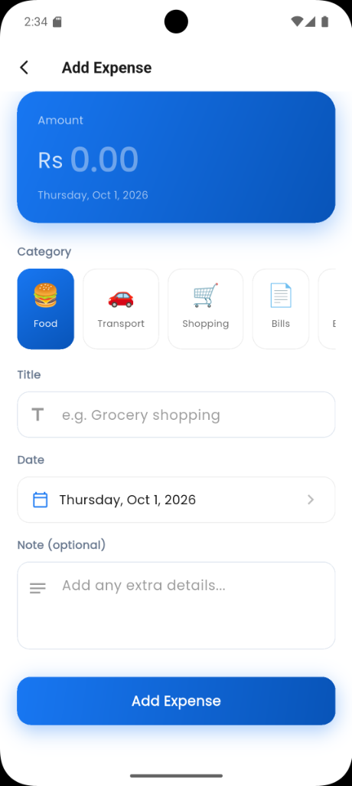</td>
  </tr>
  <tr>
    <td align="center"><strong>Sign In</strong><br><em>Email/password auth & social sign-in options</em></td>
    <td>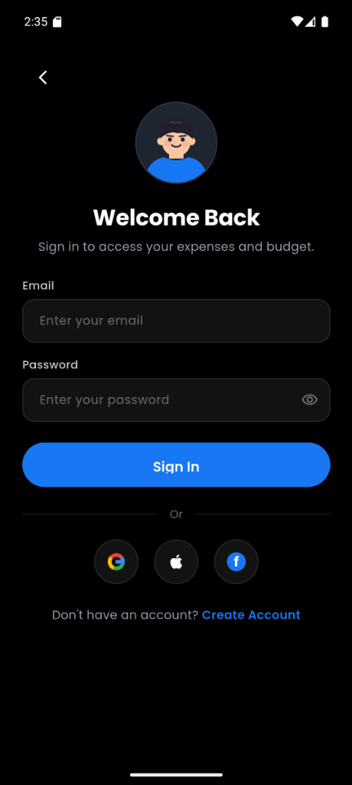</td>
    <td>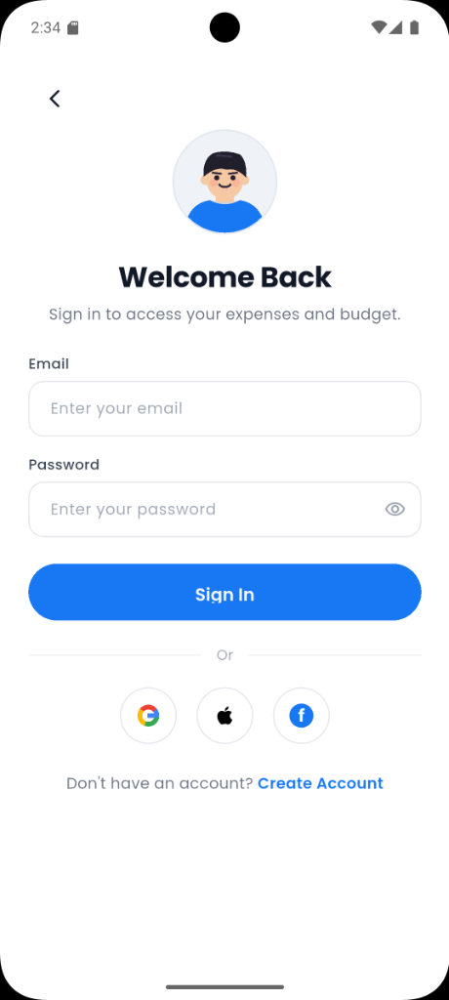</td>
  </tr>
  <tr>
    <td align="center"><strong>Sign Up</strong><br><em>New user registration with avatar header</em></td>
    <td>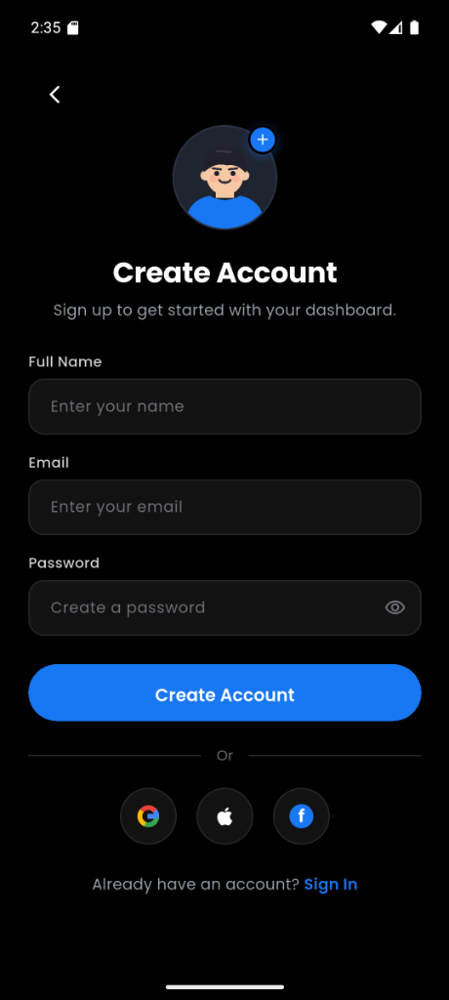</td>
    <td>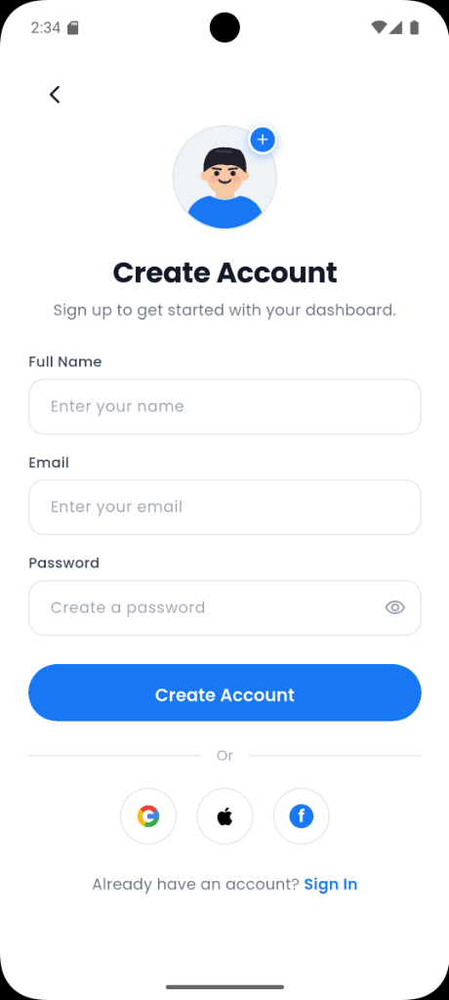</td>
  </tr>
</table>

### 🔍 Search, Trends & Settings

<table>
  <tr>
    <th align="center">Statistics (Yearly / Trends)</th>
    <th align="center">Search & Filter Expenses</th>
    <th align="center">Profile & Preferences</th>
  </tr>
  <tr>
    <td align="center">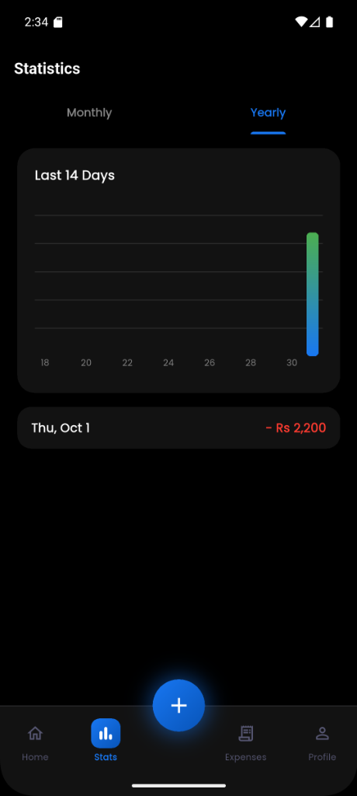</td>
    <td align="center">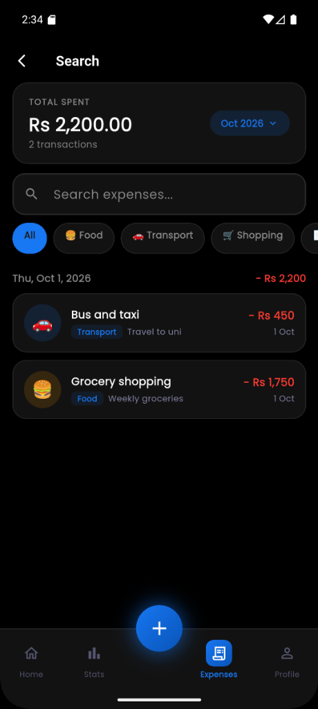</td>
    <td align="center">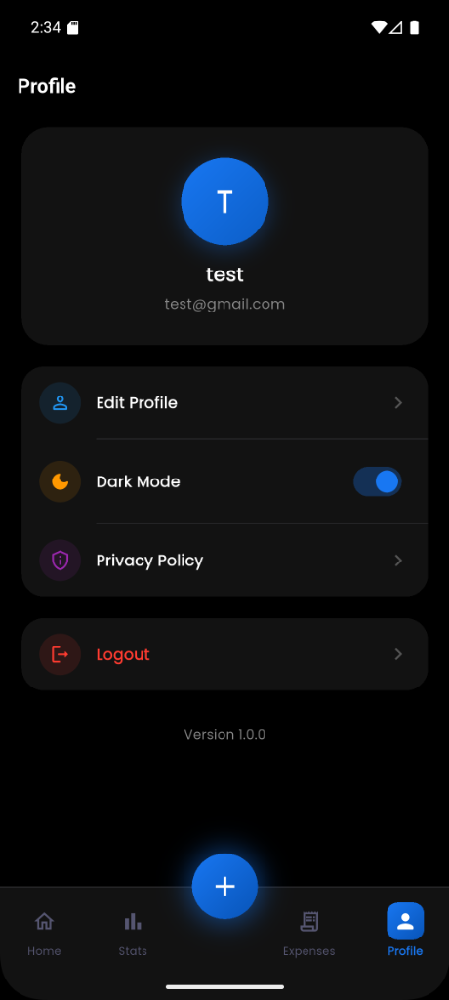</td>
  </tr>
  <tr>
    <td align="center"><em>14-day & yearly spending trend bar charts</em></td>
    <td align="center"><em>Category pill filters & search query</em></td>
    <td align="center"><em>Dark mode toggle, account management</em></td>
  </tr>
</table>

---

## ✨ Features Implemented

### 🔐 Authentication
- **Sign In & Sign Up**: Clean forms with validation for email and password using Firebase Authentication.
- **Social Auth UI**: Visual shortcuts for Google, Apple, and Facebook sign-in.
- **Auth Gate**: Auto-redirects users between Login and Main Shell depending on login status.
- **Splash Screen**: Initial loading sequence verifying authentication state.

### 🏠 Home Dashboard
- **Monthly Spending Card**: Prominent card displaying monthly totals with quick Income, Expense, and Today stats.
- **Period Filter Switcher**: Toggle dynamically between **Today**, **Weekly**, and **Monthly** timeframes.
- **Quick Summary Indicators**: Real-time counter of total transactions and highest spending category.
- **Grouped Transaction List**: Transactions neatly grouped by date with category badges, descriptions, and timestamps.
- **Dynamic Greeting**: Welcomes the user with their name or email handle.

### ➕ Expense Management (Add & Edit)
- **Amount & Date Selection**: Header card showing amount formatted in local currency, with a native date picker.
- **Visual Category Picker**: Intuitive icon grid for categories:
  - 🍔 Food
  - 🚗 Transport
  - 🛒 Shopping
  - 📄 Bills
  - 🎮 Entertainment
  - 💊 Health
  - 📚 Education
  - ✈️ Travel
  - 🔄 Subscription
  - 📦 Other
- **Note Input**: Optional extra context/details for each entry.
- **Swipe-to-Delete**: Quick dismissal of transactions with confirmation feedback.

### 📊 Analytics & Insights
- **Monthly View**: Interactive donut chart (powered by `fl_chart`) illustrating percentage and amount breakdown per category with color-coded progress bars.
- **Yearly / Trend View**: Multi-day bar chart revealing spending habits across days and months.

### 🔍 Search & Filtering
- Instant full-text search across titles and notes.
- Quick filter chips by category (Food, Transport, Shopping, etc.).
- Filter by specific month/year.

### ⚙️ Profile & Customization
- **Theme Switcher**: Instant toggle between Dark Mode 🌙 and Light Mode ☀️ with persistent local storage via `shared_preferences`.
- **Profile Info**: Displays current user avatar, name, and registered email address.
- **Secure Sign Out**: One-tap logout handling with confirmation.

---

## 🛠️ Technologies & Packages Used

| Package | Version | Purpose |
|---|---|---|
| `flutter` | SDK | Cross-platform UI toolkit |
| `firebase_core` | ^3.13.1 | Core Firebase engine initialization |
| `firebase_auth` | ^5.5.2 | User account authentication & session management |
| `cloud_firestore` | ^5.6.6 | Cloud NoSQL database with real-time stream sync |
| `provider` | ^6.1.2 | Reactive state management (`ChangeNotifier`) |
| `fl_chart` | ^0.70.2 | Interactive pie, donut, and bar chart visualizations |
| `intl` | ^0.19.0 | Currency formatting and date/time parsing |
| `google_fonts` | ^6.2.1 | Custom modern typography |
| `shared_preferences` | ^2.5.3 | Local device storage for user theme preferences |
| `uuid` | ^4.5.1 | Unique ID generator for expense records |
| `cupertino_icons` | ^1.0.8 | iOS-styled iconography |

---

## ⚙️ Project Setup Instructions

### Prerequisites

- [Flutter SDK](https://docs.flutter.dev/get-started/install) (version ≥ 3.13.4)
- [Dart SDK](https://dart.dev/get-dart) (version ≥ 3.x)
- Android Studio / VS Code with Flutter extension
- An active [Firebase Console](https://console.firebase.google.com/) project

---

### 1. Clone the Repository

```bash
git clone https://github.com/pathumsenadeera/Expense-Tracker.git
cd Expense-Tracker
```

### 2. Configure Firebase

1. Create a project in [Firebase Console](https://console.firebase.google.com/).
2. Enable **Authentication** (Email/Password provider).
3. Enable **Cloud Firestore Database**.
4. Install and configure FlutterFire CLI:
   ```bash
   dart pub global activate flutterfire_cli
   cd expense_tracker
   flutterfire configure
   ```
   *This command will link your project and generate `lib/firebase_options.dart`.*

### 3. Install Dependencies

```bash
cd expense_tracker
flutter pub get
```

### 4. Deploy Firestore Rules

Deploy the included security rules:
```bash
firebase deploy --only firestore:rules
```

### 5. Run the Application

```bash
# Run on connected device or emulator
flutter run

# To target a specific device
flutter devices
flutter run -d <device_id>
```

---

## 🤖 AI Tools Used

| Tool | Purpose |
|---|---|
| **Google Antigravity (Gemini)** | Architecture setup, feature implementation, UI design refinements, bug fixes, and documentation structure |

---

## 📄 License

This project is open source and available under the [MIT License](LICENSE).