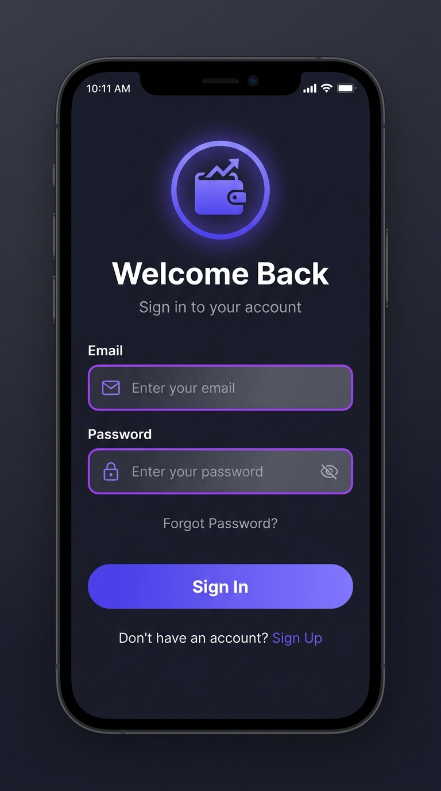
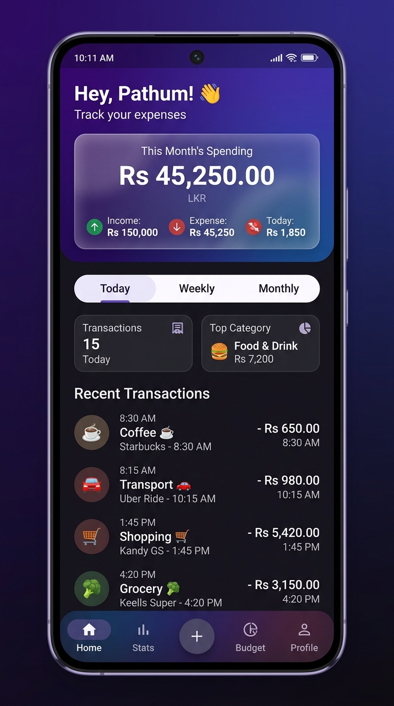
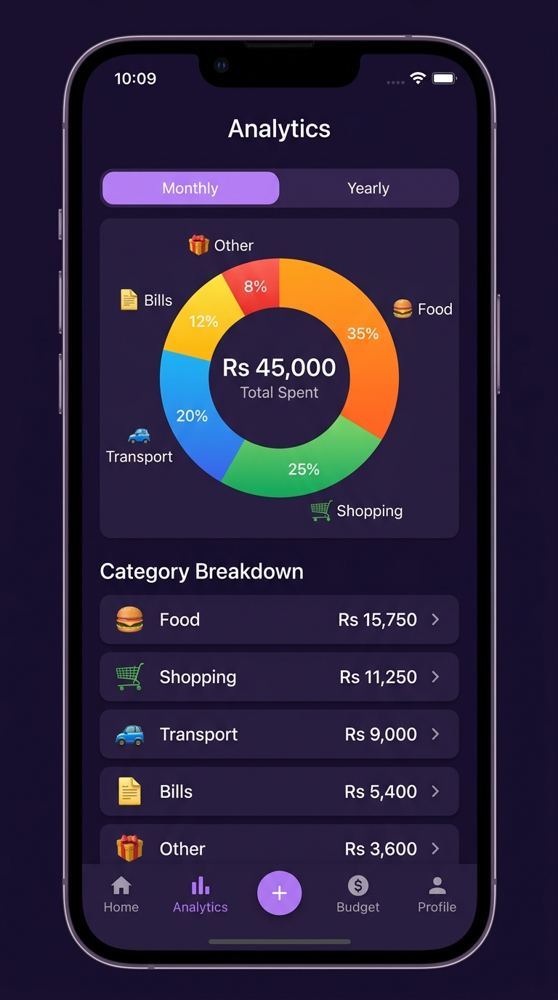

<h1 align="center">
  <br>
  💸 Expense Tracker
  <br>
</h1>

<h4 align="center">A clean, modern, Firebase-powered personal finance app built with Flutter.</h4>

<p align="center">
  
  
  
  
</p>

---

## 📸 Screenshots

<table>
  <tr>
    <td align="center"><strong>Login Screen</strong></td>
    <td align="center"><strong>Home Dashboard</strong></td>
    <td align="center"><strong>Analytics</strong></td>
  </tr>
  <tr>
    <td></td>
    <td></td>
    <td></td>
  </tr>
</table>

---

## ✨ Features

### 🔐 Authentication
- **Sign Up / Login** with email & password via Firebase Auth
- **Auth Gate** — auto-redirects between login and home based on session state
- **Splash Screen** with animated branding on first launch
- Persistent login sessions across app restarts

### 🏠 Home Dashboard
- **Hero Balance Card** with glassmorphism effect showing this month's total spending
- **Income / Expense / Today** quick stat row inside the balance card
- **Period Filter Tabs** — toggle between Today, Weekly, and Monthly views with animated selection
- **Quick Stats** — transaction count and top spending category at a glance
- **Recent Transactions** grouped by date with "Today" label for current day
- Personalized greeting using the signed-in user's display name

### ➕ Add / Edit Expenses
- Create new expenses or edit existing ones from the same screen
- **Category Picker** with 10 categories: 🍔 Food, 🚗 Transport, 🛒 Shopping, 📄 Bills, 🎮 Entertainment, 💊 Health, 📚 Education, ✈️ Travel, 🔄 Subscription, 📦 Other
- **Amount input**, **title/description**, **date picker**, and optional **notes**
- **Swipe-to-delete** with undo snackbar on the transactions list
- Form validation with user-friendly error messages

### 🔍 Search & Filter (All Expenses Screen)
- Full-text search across all expense titles
- Filter by category and custom date ranges
- Grouped list view with running total header

### 📊 Analytics Screen
- **Monthly Tab** — donut/pie chart (powered by `fl_chart`) showing category-wise spending breakdown
- **Yearly Tab** — bar chart displaying month-by-month spending trends for the current year
- Category breakdown list sorted by highest spend
- Real-time totals that update as data changes

### ⚙️ Settings / Profile Screen
- Avatar card with initials and user email
- **Dark / Light mode toggle** persisted across sessions via `shared_preferences`
- Account info section
- **Sign Out** with confirmation dialog
- **Delete all expenses** option (with safety confirmation)

### 🎨 UI / UX
- **Dark & Light theme** support with `ThemeMode` switching
- **Glassmorphism** balance card using `BackdropFilter`
- Animated period tab transitions (`AnimatedContainer`)
- Custom color system with purple-to-blue gradient (`AppTheme`)
- Google Fonts (`Nunito`) for consistent, modern typography
- Responsive layouts for various screen sizes

---

## 🗂️ Project Structure

```
lib/
├── main.dart                    # App entry point, Firebase init, AuthGate
├── firebase_options.dart        # Auto-generated Firebase config
├── models/
│   └── expense.dart             # Expense model + ExpenseCategory enum
├── providers/
│   ├── auth_provider.dart       # Auth state management (ChangeNotifier)
│   └── expense_provider.dart   # Expense CRUD, filtering, grouping, theme
├── services/
│   ├── auth_service.dart        # Firebase Auth wrapper
│   └── expense_service.dart    # Firestore CRUD operations
├── screens/
│   ├── auth/
│   │   ├── splash_screen.dart
│   │   ├── login_screen.dart
│   │   └── signup_screen.dart
│   ├── home/
│   │   └── home_screen.dart
│   ├── expenses/
│   │   ├── add_edit_expense_screen.dart
│   │   └── all_expenses_screen.dart
│   ├── analytics/
│   │   └── analytics_screen.dart
│   ├── settings/
│   │   └── settings_screen.dart
│   └── shell/
│       └── main_shell.dart      # Bottom navigation shell
├── widgets/
│   ├── expense_list_item.dart   # Reusable transaction row widget
│   └── auth_widgets.dart        # Shared auth form components
└── utils/
    └── app_theme.dart           # Theme, color tokens, gradients
```

---

## 🛠️ Technologies & Packages Used

| Package | Version | Purpose |
|---|---|---|
| `flutter` | SDK | Core UI framework |
| `firebase_core` | ^3.13.1 | Firebase initialization |
| `firebase_auth` | ^5.5.2 | User authentication |
| `cloud_firestore` | ^5.6.6 | Real-time NoSQL database |
| `provider` | ^6.1.2 | State management (ChangeNotifier) |
| `fl_chart` | ^0.70.2 | Pie charts & bar charts in Analytics |
| `intl` | ^0.19.0 | Date & currency formatting |
| `google_fonts` | ^6.2.1 | Nunito font family |
| `shared_preferences` | ^2.5.3 | Persist theme mode locally |
| `uuid` | ^4.5.1 | Generate unique expense IDs |
| `cupertino_icons` | ^1.0.8 | iOS-style icon set |

---

## ⚙️ Project Setup Instructions

### Prerequisites

- [Flutter SDK](https://docs.flutter.dev/get-started/install) ≥ 3.13.4
- [Dart SDK](https://dart.dev/get-dart) ≥ 3.x (bundled with Flutter)
- A [Firebase](https://console.firebase.google.com/) project with **Authentication** and **Firestore** enabled
- Android Studio / VS Code with the Flutter & Dart plugins installed

---

### 1. Clone the Repository

```bash
git clone https://github.com/pathumsenadeera/Expense-Tracker.git
cd Expense-Tracker
```

### 2. Set Up Firebase

1. Go to [Firebase Console](https://console.firebase.google.com/) and create a new project (or use an existing one).
2. Enable **Authentication** → **Email/Password** sign-in method.
3. Enable **Cloud Firestore** and set it to production or test mode.
4. Install the [FlutterFire CLI](https://firebase.flutter.dev/docs/cli/):
   ```bash
   dart pub global activate flutterfire_cli
   ```
5. Configure Firebase for your app:
   ```bash
   cd expense_tracker
   flutterfire configure
   ```
   This auto-generates `lib/firebase_options.dart`.

### 3. Install Dependencies

```bash
cd expense_tracker
flutter pub get
```

### 4. Configure Firestore Security Rules

Deploy the included rules to your Firebase project:

```bash
# From the repo root
firebase deploy --only firestore:rules
```

Or paste the contents of `firestore.rules` directly in the Firebase Console.

### 5. Run the App

```bash
# Android / iOS (with a device or emulator connected)
flutter run

# For a specific device
flutter run -d <device-id>

# List available devices
flutter devices
```

### 6. Build for Production *(optional)*

```bash
# Android APK
flutter build apk --release

# Android App Bundle (for Play Store)
flutter build appbundle --release

# iOS (requires macOS + Xcode)
flutter build ipa --release
```

---

## 🔥 Firestore Data Structure

```
users/{userId}/expenses/{expenseId}
  ├── id         : String   (UUID)
  ├── userId     : String   (Firebase Auth UID)
  ├── title      : String
  ├── amount     : Number
  ├── category   : String   (e.g. "food", "transport")
  ├── date       : Timestamp
  ├── note       : String?  (optional)
  └── createdAt  : Timestamp
```

---

## 🤖 AI Tools Used

This project was built with assistance from the following AI tools:

| Tool | Role |
|---|---|
| **Google Antigravity (Gemini)** | Primary coding assistant — architecture design, feature implementation, bug fixing, code reviews, and README generation |
| **Google Gemini** | Generating UI mockup images for documentation screenshots |

> All code was reviewed, tested, and refined by the developer. AI tools were used to accelerate development, not replace engineering judgment.

---

## 🤝 Contributing

Pull requests are welcome! For major changes, please open an issue first to discuss what you'd like to change.

1. Fork the repo
2. Create your feature branch: `git checkout -b feature/amazing-feature`
3. Commit your changes: `git commit -m 'Add amazing feature'`
4. Push to the branch: `git push origin feature/amazing-feature`
5. Open a Pull Request

---

## 📄 License

This project is open source and available under the [MIT License](LICENSE).

---

<p align="center">Made with ❤️ using Flutter & Firebase</p>